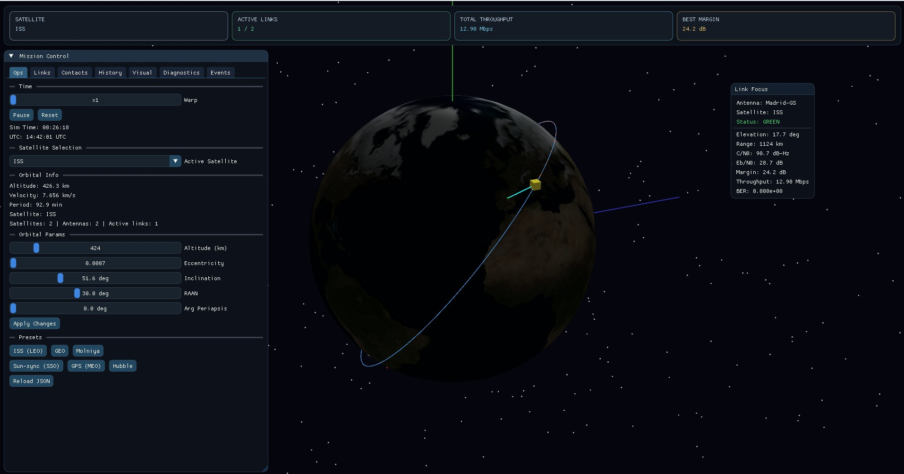

# 🛰️ Satellite Downlink Simulator

A real-time 3D mission-control app for Earth and Moon satellite downlink simulation.

It combines orbital propagation, ground-station tracking, and RF link-budget telemetry in an OpenGL + Dear ImGui interface. You can run custom JSON scenarios, import real satellites from CelesTrak, and track contacts/throughput live around Earth or the Moon.



## Features

- **Mission-control UI** with tabs for Ops, Links, Contacts, History, Visual, Diagnostics, Events, and Real Satellites.
- **Orbital propagation** using Keplerian elements plus TLE-based initialization (`sgp4_tle` mode), for Earth-centered and Moon-centered cases.
- **3D Earth + Moon scene** with lit bodies, textured Milky Way background, orbit paths, satellite marker, and optional trail.
- **Interactive camera and time control**: rotate/zoom, warp, pause, reset.
- **Ground-station tracking** with azimuth/elevation slewing and lock logic for Earth and lunar scenarios.
- **Downlink link budget**: visibility, AOS/LOS, FSPL, rain fade, C/N0, Eb/N0, margin, BER, throughput, including Moon-occlusion checks.
- **Throughput modeling**: Shannon mode or Eb/N0 threshold table.
- **Scenario-driven setup** from `config/satellites.json`, `config/antennas.json`, and `config/sim.json`.
- **Real satellite import** from CelesTrak: fetch top active satellites or single NORAD ID from the UI.
- **Offline cache fallback** for fetched TLEs in `config/.cache`.
- **Diagnostics and event logging** for config problems, link events, and fetch issues.
- **CSV export** for contact summaries (`contact_report.csv`).
- **Lunar controls**: Moon focus, lunar orbit rendering, larger deep-space warp range, and Warp to Trackable for lunar passes.

## Requirements

- **Windows 10/11**
- **CMake** >= 3.16 — [Download](https://cmake.org/download/)
- **Git** — [Download](https://git-scm.com/)
- **C++17 compiler**: Visual Studio 2019/2022, MinGW, or Clang
- **GPU with OpenGL 3.3** support

## Build

### Quick option

```batch
build.bat
```

### Manual

```batch
mkdir build
cd build
cmake .. -G "Visual Studio 17 2022" -A x64
cmake --build . --config Release
Release\simulator.exe
```

## Controls

| Key         | Action                        |
| ----------- | ----------------------------- |
| Mouse drag  | Rotate camera                 |
| Mouse wheel | Zoom                          |
| `+` / `-`   | Increase / decrease time warp |
| `Space`     | Pause / resume                |
| `R`         | Reset simulation              |
| `ESC`       | Exit                          |

## Orbital Parameters (ISS)

| Parameter       | Value     |
| --------------- | --------- |
| Semi-major axis | 6,779 km  |
| Eccentricity    | 0.0007    |
| Inclination     | 51.6°     |
| Period          | ~92.7 min |
| Altitude        | ~408 km   |

## Project Structure

```text
SIMULATOR/
├── main.cpp          # Main entry point, UI and render loop
├── CMakeLists.txt    # Build configuration (auto-fetches dependencies)
├── build.bat         # Quick build script
├── src/
│   ├── scenario.h    # Domain types + config-loading API
│   ├── scenario.cpp  # JSON parsing/validation for satellites, antennas, sim
│   ├── orbit.h       # Orbital and geospatial utility API
│   └── orbit.cpp     # Kepler propagation and math helper implementation
├── config/
│   ├── satellites.json
│   ├── antennas.json
│   └── sim.json
└── README.md
```

## Scenario Configuration (JSON)

At startup, the simulator attempts to load:

- `config/satellites.json`
- `config/antennas.json`
- `config/sim.json`

If any file is missing or invalid, defaults are used and warnings are shown in Diagnostics.

You can reload all scenario files at runtime with **Reload JSON** in the Ops tab.

## Current Implementation Status

- JSON-driven configuration flow is active.
- Ground-station placement and tracking on globe is active.
- Earth-to-satellite and Moon-to-satellite workflows are active.
- Real-time communication simulation is active.
- TLE-based initialization path is active.
- Active satellite selection for multi-satellite scenarios is active.
- Real-satellite fetch/import tab is active (CelesTrak + cache).

## Modifying Orbits

You can modify orbit parameters directly from the UI (Ops tab), or by editing `config/satellites.json`.

If you need code-level orbital behavior changes, see `src/orbit.cpp` and its usage in `main.cpp`.

Example satellite entry in JSON:

```json
{
  "name": "GEO Demo",
  "propagator": "kepler",
  "orbit": {
    "altitude_km": 35786,
    "eccentricity": 0.0,
    "inclination_deg": 0.0,
    "raan_deg": 0.0,
    "arg_periapsis_deg": 0.0,
    "mean_anomaly_deg": 0.0
  }
}
```
