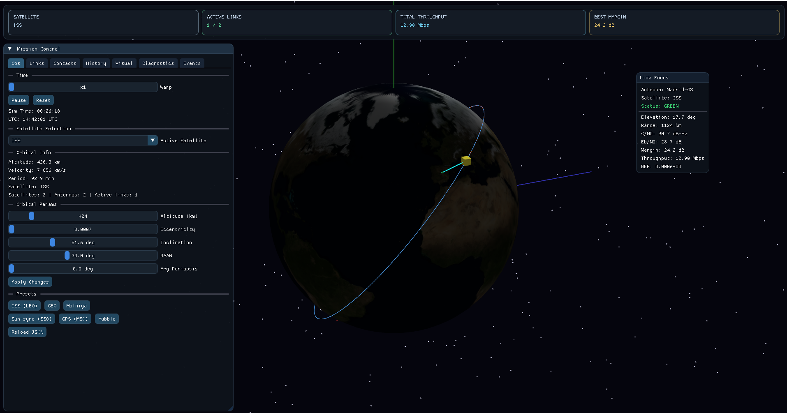

# 🛰️ Orbital Simulator — Earth + Satellite

A 3D simulator that renders Earth and one or more satellites using Keplerian orbital mechanics, OpenGL 3.3, and Dear ImGui.



## Features

- **Real orbital mechanics**: Kepler equation solved with Newton-Raphson.
- **ISS baseline orbit**: LEO at 408 km, 51.6° inclination, e ≈ 0.0007.
- **3D rendering**: lit Earth (Blinn-Phong), satellite model, orbit path.
- **Interactive camera**: rotate and zoom.
- **Real-time telemetry**: altitude and orbital velocity in the window title.
- **Starfield background** and satellite trail.
- **Time control**: accelerate, pause, reset.
- **JSON scenarios**: loads `config/satellites.json`, `config/antennas.json`, `config/sim.json`.
- **Ground stations**: geodetic placement on the globe and automatic tracking.
- **Link simulation**: visibility, AOS/LOS, lock/unlock, FSPL, C/N0, Eb/N0, margin, BER, throughput.
- **Selectable throughput model**: Shannon or Eb/N0 threshold table.
- **TLE route**: supports `propagator: "sgp4_tle"` with `tle.line1` and `tle.line2` in `satellites.json`.
- **Multi-satellite scenarios**: `satellites` array support with active satellite selection in UI.
- **Stronger JSON validation**: warnings/errors for range, type, and required fields in Diagnostics tab.
- **Contact summaries**: pass count and current/last contact duration per antenna.
- **Live history plots**: margin and throughput over time.
- **Report export**: generates `contact_report.csv`.

## Requirements

- **Windows 10/11**
- **CMake** >= 3.16 — [Download](https://cmake.org/download/)
- **Git** — [Download](https://git-scm.com/)
- **C++17 compiler**: Visual Studio 2019/2022, MinGW, or Clang
- **GPU with OpenGL 3.3** support

## Build

### Quick option

```batch
build.bat
```

### Manual

```batch
mkdir build
cd build
cmake .. -G "Visual Studio 17 2022" -A x64
cmake --build . --config Release
Release\simulator.exe
```

## Controls

| Key         | Action                        |
| ----------- | ----------------------------- |
| Mouse drag  | Rotate camera                 |
| Mouse wheel | Zoom                          |
| `+` / `-`   | Increase / decrease time warp |
| `Space`     | Pause / resume                |
| `R`         | Reset simulation              |
| `ESC`       | Exit                          |

## Orbital Parameters (ISS)

| Parameter       | Value     |
| --------------- | --------- |
| Semi-major axis | 6,779 km  |
| Eccentricity    | 0.0007    |
| Inclination     | 51.6°     |
| Period          | ~92.7 min |
| Altitude        | ~408 km   |

## Project Structure

```text
SIMULATOR/
├── main.cpp          # Main entry point, UI and render loop
├── CMakeLists.txt    # Build configuration (auto-fetches dependencies)
├── build.bat         # Quick build script
├── src/
│   ├── scenario.h    # Domain types + config-loading API
│   ├── scenario.cpp  # JSON parsing/validation for satellites, antennas, sim
│   ├── orbit.h       # Orbital and geospatial utility API
│   └── orbit.cpp     # Kepler propagation and math helper implementation
├── config/
│   ├── satellites.json
│   ├── antennas.json
│   └── sim.json
└── README.md
```

## Scenario Configuration (JSON)

At startup, the simulator attempts to load:

- `config/satellites.json`
- `config/antennas.json`
- `config/sim.json`

If any file is missing or invalid, defaults are used and warnings are shown in Diagnostics.

You can reload all scenario files at runtime with **Reload JSON** in the Ops tab.

## Current Implementation Status

- JSON-driven configuration flow is active.
- Ground-station placement and tracking on globe is active.
- Real-time communication simulation is active.
- TLE-based initialization path is active.
- Active satellite selection for multi-satellite scenarios is active.

## Modifying Orbits

You can modify orbit parameters directly from the UI (Ops tab), or by editing `config/satellites.json`.

If you need code-level orbital behavior changes, see `src/orbit.cpp` and its usage in `main.cpp`.

Example satellite entry in JSON:

```json
{
  "name": "GEO Demo",
  "propagator": "kepler",
  "orbit": {
    "altitude_km": 35786,
    "eccentricity": 0.0,
    "inclination_deg": 0.0,
    "raan_deg": 0.0,
    "arg_periapsis_deg": 0.0,
    "mean_anomaly_deg": 0.0
  }
}
```
